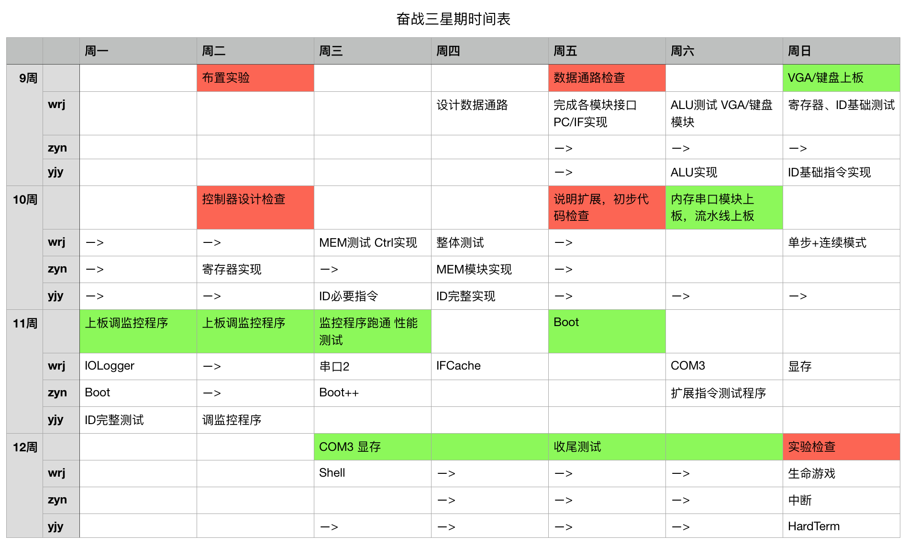
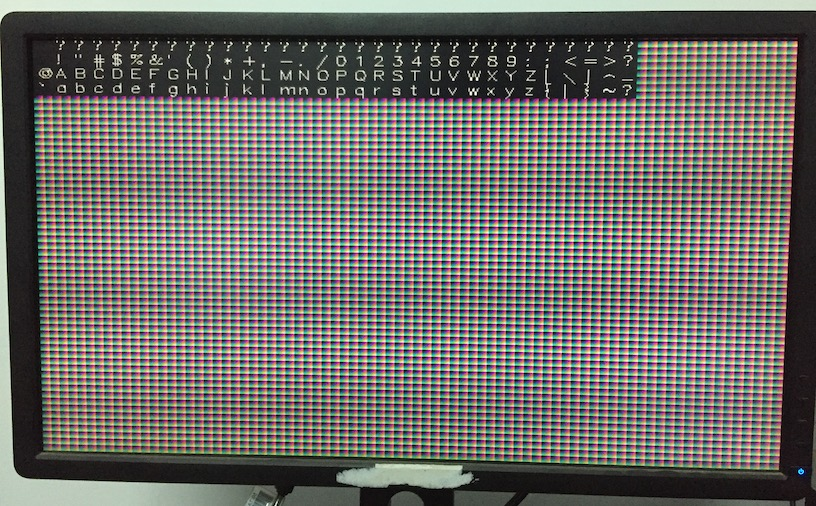
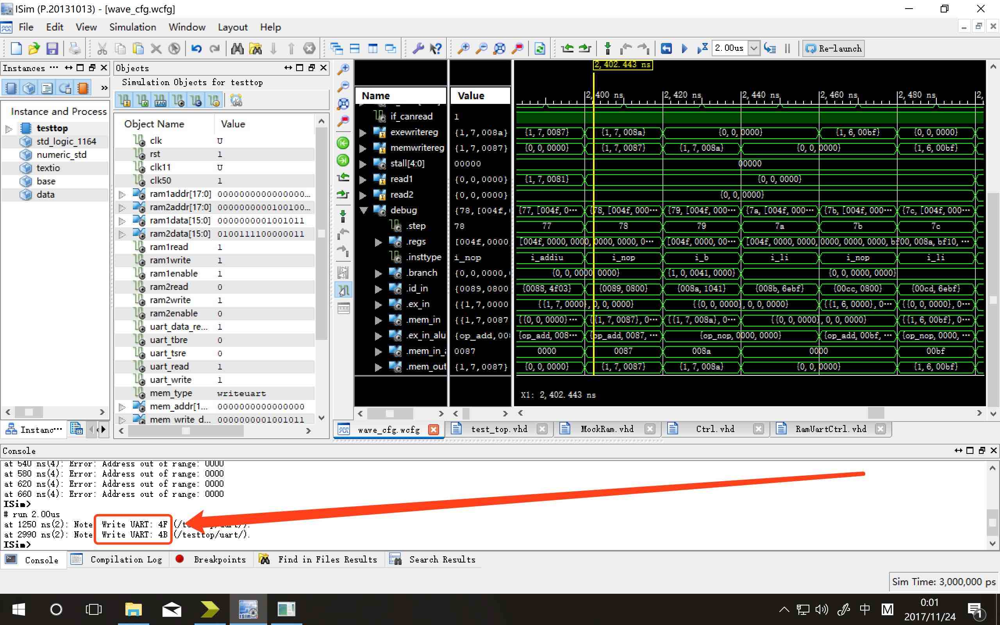
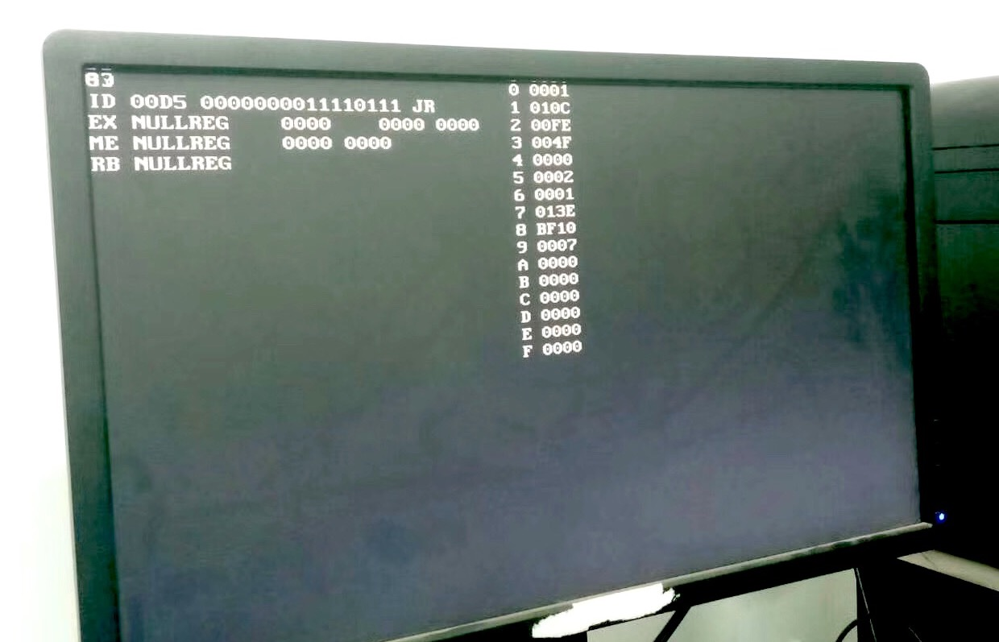
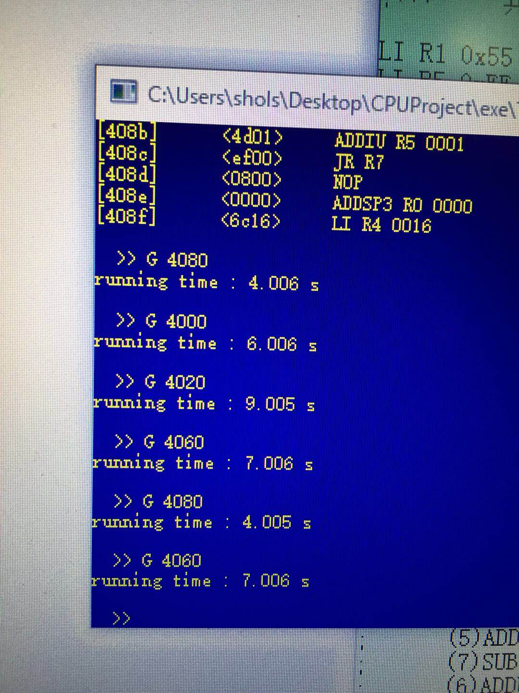
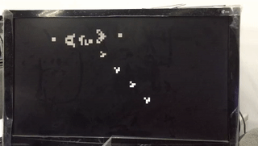
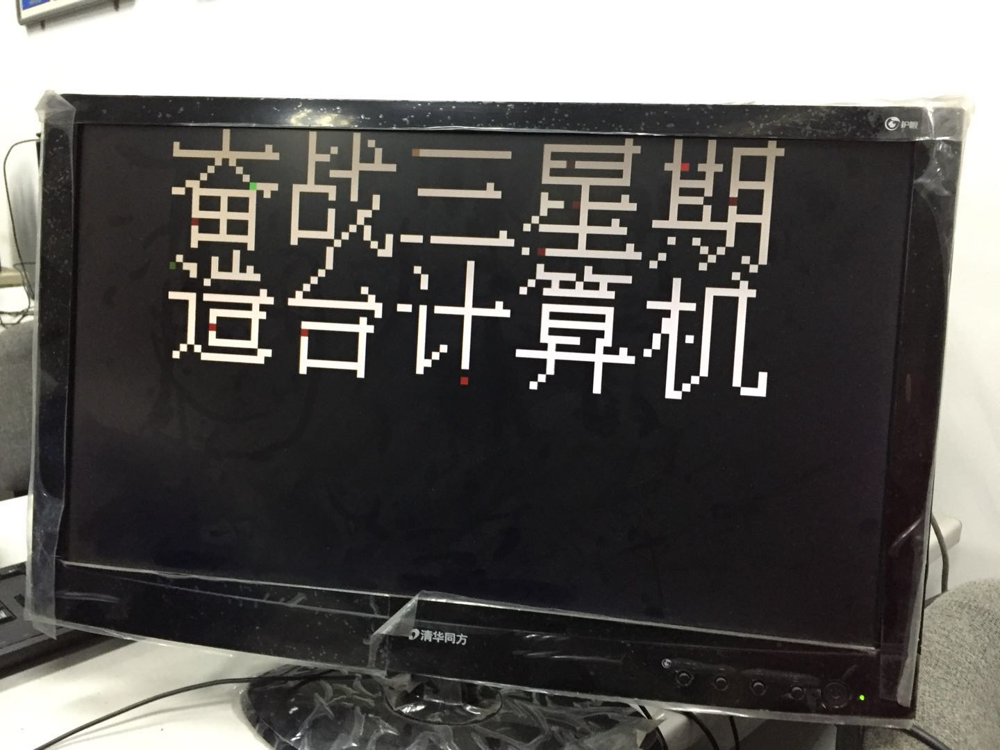

# 计算机组成原理 大实验报告

计53 王润基 杨跻云 张耀楠

【奋战三星期 做台计算机】2017.11.14 - 2017.12.10

[TOC]

## 实现的功能

* 流水线CPU，最高频率40MHz
  * 支持25条基本指令和5条扩展指令
  * 支持外部中断
  * 取指Cache，缓解结构冲突
* 扩展功能
  * Boot：开机自动将程序从Flash拷贝到RAM
  * VGA和键盘
  * 实时显示丰富的调试信息，支持断点和单步调试
  * HardTerm：将Term移植到板上，可直接用键盘操作
  * 支持显存，可编程控制显示内容
  * 简单的MIPS16e编译器

## 性能测试结果

## 整体架构设计

### 整体架构

* CPU模块：
* Renderer模块：渲染器

### CPU架构

### HardTerm架构

## 各模块细节

### 基础头文件

* Base：定义了所有的基础类型、常数、函数
* Show：定义了渲染器所需的格式化toString函数

### CPU模块

* IF取指

* ID译码

* EX执行

* MEM访存

  读入EXE中运算器的计算结果，以及是否读/写RAM，是否写某个寄存器的相关信号，进行处理并传递给RamUartCtrl模块和Reg模块。

* Reg（RB）

  主要是实现了寄存器。为了方便，特殊寄存器也统一编号，寄存器数组(15 downto 0)。根据传入的信号，可以读取某两个寄存器的值、修改某个寄存器，以及修改R6和IH寄存器(处理中断时)。

* 触发器（ID_IF IF_ID ID_EX EX_MEM）

* Ctrl

* 中断的实现

  实现了外部中断。当中断信号给到cpu(我们具体展示的中断信号只有某几种键盘事件)，cpu根据IH寄存器的高位判断目前是否可以中断。如果可以中断，修改IH进入核心态并把中断码也写入IH寄存器的某几位，拦截IF到ID旁路的内容实现在下一周期跳转到中断程序，并把当前PC保存到R6。

  在中断程序中，根据中断码进行不同的处理，并最后跳转到R6(回到用户程序)/R7(结束用户程序)。这一部分使用汇编实现。原本的中断程序默认中断时把各种信息都压入栈中，我们认为这一设计极不科学，所以做了较大修改。

### IO模块（RamUartCtrl）

协调处理所有的IO请求。

控制的设备接口：

* RAM1
* RAM2
* 串口1
* 串口2
* 1个数据缓冲区

接受的IO请求接口：（优先级依次递减）

* Boot模块：写RAM2（指令区）
* CPU的MEM模块：读写RAM1/RAM2/串口1/串口2/数据缓冲区
* CPU的IF模块：读RAM2（指令区）
* Renderer模块：读RAM1（显存区）

限于CPU要求在1个周期内完成 [提出请求-访存-拿到结果] 的全过程，因此模块主体是纯组合逻辑，写信号的下拉操作利用时钟信号后半周期完成。唯一涉及的时序逻辑是读串口时会强行延迟20周期。

#### 内存地址映射

* BF00/BF01：串口1 数据/标志
* BF02/BF03：串口2 数据/标志
* BF04/BF05：缓冲区 数据/标志
* E000-FFFF：显存区

### Renderer模块

控制屏幕显示内容。输入VGA正在显示的像素坐标，输出像素颜色。纯组合逻辑。

### HardTerm模块

### 其它辅助模块

* vga_controller：开源代码。生成VGA控制信号和当前屏幕坐标。
* ps2_keyboard_to_ascii：开源代码。将PS2信号解码为按键信号和ASCII码。
* uart：提供代码。将串口2信号转化为和串口1相同的格式。
* Boot：读取Flash并告知IO模块当前要写RAM2的地址和数据
* DataBuffer：数据缓冲区，提供读写接口（信号格式同RAM）
* Shell：一种特殊的DataBuffer，有两个写接口，额外支持退格和回车
* AsciiToBufferInput：将ASCII信号转化为Buffer写信号
* FontReader：从片内ROM中读取字体点阵数据
* PixelReader：将像素块坐标转化为RAM1地址，委托IO模块读取显存

## 进程·问题·优化·妥协

第9周周日，第一版VGA。VGA引脚反了，调了一小时。

第10周周四，在仿真中跑出OK。

第10周周日，第一版调试信息界面，可以板上输出OK。

第11周周三，监控程序跑通，25MHz性能测试。

第12周周日，生命游戏，显示汉字，实现中断。

